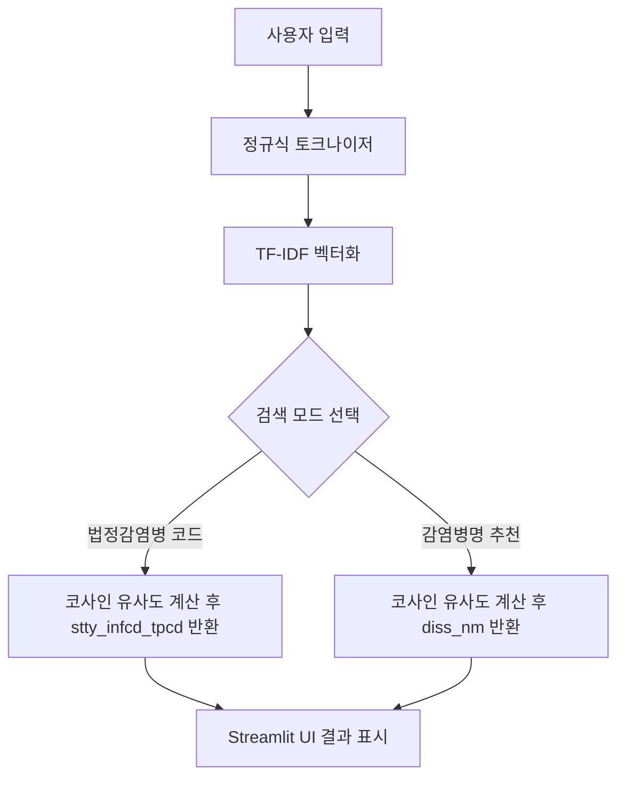

# 법정감염병분류 챗봇

> 📌 **분류**: 자연어처리(NLP) - 분류

## 🛠️ 기술 스택 (Tech Stack)
<p>
  
  
  
  
</p>

## 👥 참여인원 (Member)
<p>
  
</p>

## 프로젝트 개요
국내 법정감염병 데이터를 기반으로 진단명과 법정감염병 분류 코드를 자동으로 연결해 주는 Streamlit 애플리케이션입니다. 의료 현장에서 사용하는 진단명을 입력하면 TF-IDF 기반의 질의-문서 유사도 분석을 통해 가장 적합한 감염병 코드를 추천합니다. 또한 동일한 데이터셋을 활용하여 진단명에 가장 유사한 감염병명을 탐색할 수 있어 역방향 탐색이 가능합니다.

## 주요 기능
- **법정감염병 코드 검색**: 진단명을 입력하면 TF-IDF 벡터화 후 코사인 유사도를 계산해 최적의 `stty_infcd_tpcd` 코드를 반환합니다.
- **감염병명 추천**: 진단명을 기준으로 가장 유사한 감염병명을 찾아주는 역방향 검색 기능을 제공합니다.
- **데이터 통계(준비 중)**: 데이터셋 기반의 통계 시각화를 추가할 예정입니다.

## 기술 스택
- **언어**: Python
- **웹 프레임워크**: Streamlit
- **자연어 처리**: NLTK(RegExpTokenizer), scikit-learn(TfidfVectorizer, cosine_similarity)
- **데이터 관리**: pandas, CSV 기반 원천 데이터셋

## 데이터 파이프라인
1. `TB_LM_OUT_RATE_S_dt_with_diss_nm_2.csv` 파일에서 감염병명(`diss_nm`), 진단명(`diag_nm`), 감염병 유형 코드(`stty_infcd_tpcd`)를 로드합니다.
2. 감염병명과 진단명을 결합한 텍스트에 대해 정규식 토크나이저로 명사성 단어를 추출합니다.
3. 추출된 토큰을 TF-IDF 벡터 공간으로 변환하여 고정된 임베딩을 생성합니다.
4. 사용자가 입력한 문장을 동일한 전처리 과정을 거쳐 벡터화한 뒤, 사전 계산된 행렬과 코사인 유사도를 계산해 최고 점수 항목을 반환합니다.
5. 유사도가 0인 경우 기본값(법정감염병 분류 4번 또는 "매칭 없음")을 제공하여 예외 상황에 대응합니다.

## 시스템 구조


## 실행 방법
1. 저장소 클론 후 가상환경을 준비합니다.
2. 필수 패키지를 설치합니다.
   ```bash
   pip install streamlit pandas scikit-learn nltk
   ```
3. NLTK 토크나이저가 처음 실행될 때 추가 리소스가 필요하다면 `nltk.download('punkt')` 등을 호출합니다.
4. Streamlit 애플리케이션을 실행합니다.
   ```bash
   streamlit run streamlit/stream-lit.py
   ```
5. 웹 브라우저에서 `법정감염병코드검색` 또는 `감염병검색` 메뉴를 선택하여 기능을 체험합니다.

## 데이터셋 경로 설정 주의사항
`streamlit/stream-lit.py`에 정의된 `file_path` 변수는 로컬 윈도우 경로를 가리키고 있습니다. 배포 환경에 맞게 다음과 같이 상대 경로로 수정하는 것을 권장합니다.
```python
file_path = Path(__file__).parent / "TB_LM_OUT_RATE_S_dt_with_diss_nm_2.csv"
```

## 향후 개선 아이디어
- 데이터 통계 메뉴에 감염병 발생 추이 및 국가별 분포 시각화 추가
- 유사도 기반 추천 결과에 대한 상위 N개 후보 제공 및 신뢰도 히트맵 시각화
- 사용자 입력 교정(오탈자, 동의어 처리)을 위한 한국어 형태소 분석기 연동
- 모델 성능 향상을 위한 Bi-Encoder 또는 사전학습 언어모델(KoBERT, KoELECTRA 등) 적용 연구
